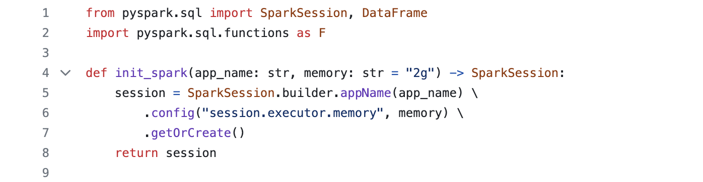

Week 10: PySpark Data Processing

Requirements
* Use PySpark to perform data processing on a large dataset
* Include at least one Spark SQL query and one data transformation
  
Grading Criteria
* Data processing functionality (20 points)
* Use of Spark SQL and transformations (20 points)
  
Deliverables
* PySpark script

part 1: intializing pyspark:

* Output data or summary report (PDF or markdown)

